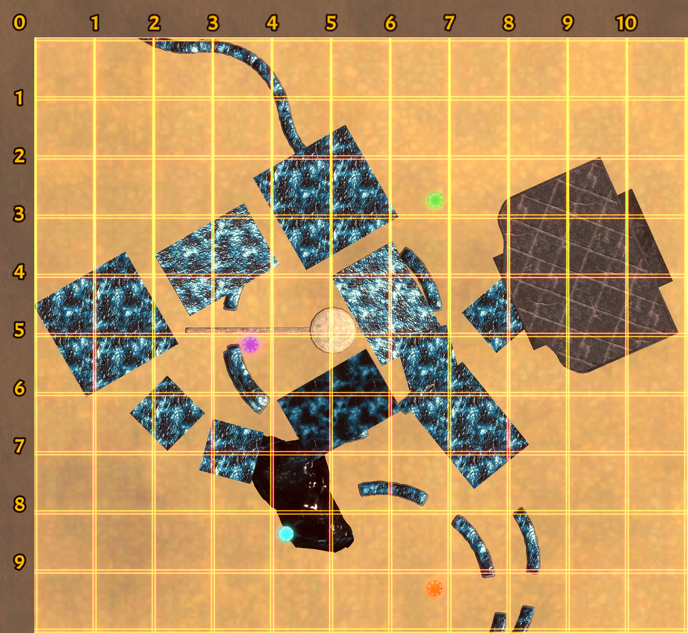

# DragonHop-Shoot

DragonHop-Shoot is a companion tool for the Twitch Integration system in **Dragon Hop**.  
It allows chatters to access coordinate maps and quickly copy the chat command needed to interact with the streamer's game.

To access the tool, head to the GitHub page:
https://dustriderstudios.github.io/DragonHop-Shoot/

---

# How To Use

1. Select the map the broadcaster is currently progressing through.
2. Click anywhere on the coordinate map.
3. The required command and coordinates will automatically be copied to your clipboard.
4. Paste the copied command into Twitch chat.

---

# How To Enable Twitch Integration (Streamer Setup)

1. Open the game's **Settings** menu.
2. Enable **Twitch Integration**.
3. Enter your Twitch channel name.
4. Enter the username of a bot (or any user) that has access to your chat.
5. Authorize the connection.
6. Configure chat difficulty, or leave it on automatic mode. (Optional)

---

# Coordinate Maps

## Ice

---

## Snake

---

## Castle

---

## Volcano

---

Have fun and happy hopping! 🐉
